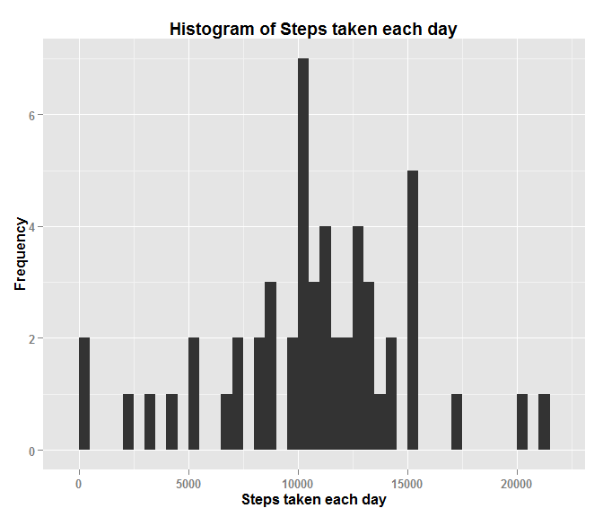
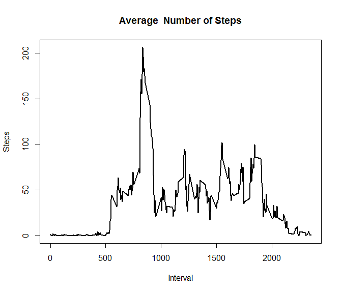
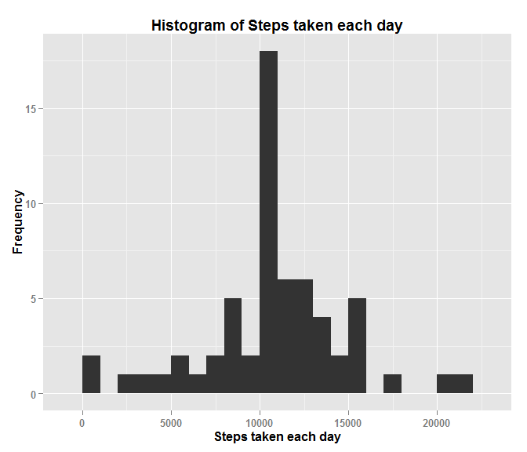
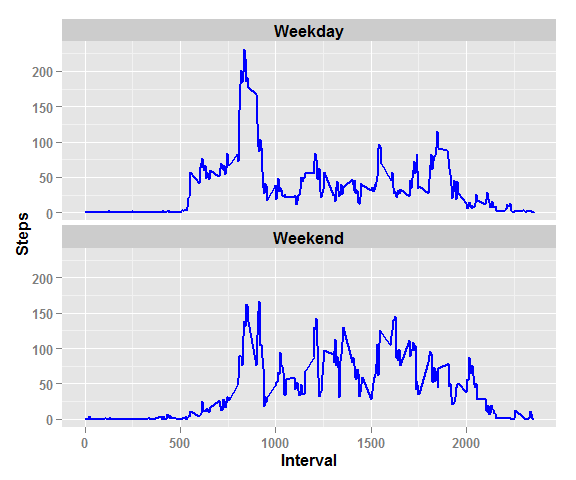

# Reproducible Research: Peer Assessment 1
Arpita Satarkar  
January 8, 2016  


## Introduction

This assignment makes use of data from a personal activity monitoring device. This device collects data at 5 minute intervals through out the day. The data consists of two months of data from an anonymous individual collected during the months of October and November, 2012 and include the number of steps taken in 5 minute intervals each day.

Below are the details required for the completion of the assignment questions.


#### Loading Libraries


```r
library(knitr)
opts_chunk$set(echo = TRUE)

library(lubridate)
library(ggplot2)
library(sqldf)
```

```
## Loading required package: gsubfn
## Loading required package: proto
## Loading required package: RSQLite
## Loading required package: DBI
```


### Loading and preprocessing the data

We need to first download the data and keep in our local folder. Then we process the data and convert the necessary fields to the required formats for further processing. We also display the sample data to know how the data looks like.

#### Read and load the data into R environment

The first step is to read the activity data using read.csv() function:


```r
activity <- read.csv("C:/Users/satarar/Documents/ReproducibleResearch/data/activity.csv",header = TRUE)
```

#### Date column Conversion

Converting the date field from factor to date


```r
activity$date <- ymd(activity$date)
```

#### Data Summary and Sample Activity data


```r
str(activity)
```

```
## 'data.frame':	17568 obs. of  3 variables:
##  $ steps   : int  NA NA NA NA NA NA NA NA NA NA ...
##  $ date    : POSIXct, format: "2012-10-01" "2012-10-01" ...
##  $ interval: int  0 5 10 15 20 25 30 35 40 45 ...
```

```r
head(activity,10)
```

```
##    steps       date interval
## 1     NA 2012-10-01        0
## 2     NA 2012-10-01        5
## 3     NA 2012-10-01       10
## 4     NA 2012-10-01       15
## 5     NA 2012-10-01       20
## 6     NA 2012-10-01       25
## 7     NA 2012-10-01       30
## 8     NA 2012-10-01       35
## 9     NA 2012-10-01       40
## 10    NA 2012-10-01       45
```


### What is mean total number of steps taken per day?

We first remove the NA data from the activity i.e. clean the data and then aggregate the steps by date so as to obtain the number of steps taken each day. We further calculate mean and median from this data.

#### Cleaning the data to remove the NA values


```r
activityp <- activity[complete.cases(activity),]
summarysteps <- aggregate(activityp$steps, by=list(activityp$date), FUN=sum, na.rm=TRUE)
colnames(summarysteps) <- c("Date","NumberofSteps")
```

#### Data for Histogram


```r
head(summarysteps,10)
```

```
##          Date NumberofSteps
## 1  2012-10-02           126
## 2  2012-10-03         11352
## 3  2012-10-04         12116
## 4  2012-10-05         13294
## 5  2012-10-06         15420
## 6  2012-10-07         11015
## 7  2012-10-09         12811
## 8  2012-10-10          9900
## 9  2012-10-11         10304
## 10 2012-10-12         17382
```

#### Plot the Histogram for total steps taken each day


```r
qplot(summarysteps$NumberofSteps, xlab = "Steps taken each day", ylab = "Frequency", main = "Histogram of Steps taken each day", binwidth = 500)+
     theme(plot.title = element_text(size = 14, face="bold")) +
    theme(text = element_text(size = 12, face="bold"))
```

 


### Mean and Median number of steps taken each day

Here we use the mean and median functions and apply them over the summary data that we calculated for each day. The data set that we refer to has already ignored NA values.

#### Mean of steps taken each day


```r
meansteps <- mean(summarysteps$NumberofSteps)
meansteps
```

```
## [1] 10766.19
```

#### Median of steps taken each day


```r
mediansteps <- median(summarysteps$NumberofSteps)
mediansteps
```

```
## [1] 10765
```


### What is the average daily activity pattern?

To obtain the daily activity pattern w.r.t. the interval we first calculate the average number of steps by interval across all the days and then plot the graph.

#### Average number of steps for each interval


```r
averagesteps <- aggregate(activityp$steps, by=list(activityp$interval), FUN=mean, na.rm=TRUE)
colnames(averagesteps) <- c("Interval","AverageSteps")
```

#### Data for Plot


```r
head(averagesteps,10)
```

```
##    Interval AverageSteps
## 1         0    1.7169811
## 2         5    0.3396226
## 3        10    0.1320755
## 4        15    0.1509434
## 5        20    0.0754717
## 6        25    2.0943396
## 7        30    0.5283019
## 8        35    0.8679245
## 9        40    0.0000000
## 10       45    1.4716981
```

#### Plot for average number of steps for each interval


```r
with(averagesteps,plot(Interval, AverageSteps, type = "l", main = "Average  Number of Steps", ylab = "Steps", lwd=2))
```

 


#### The 5-minute interval that, on average, contains the maximum number of steps

From the above calculated data for average steps for each interval we find the interval with maximum average number of steps across all the days.


```r
maxstepsinterval <- averagesteps[which.max(averagesteps$AverageSteps),]
maxstepsinterval
```

```
##     Interval AverageSteps
## 104      835     206.1698
```


### Imputing missing values

We follow the below steps as part of our strategy to impute missing values.
1) First we have to identify the data points where the values for steps is not recorded.
2) Then we replace the missing values for steps with the average values for that interval across all the data period.
3) Bind the results of earlier calculated good subset data with the data with NA values imputed to form the full data set.
4) Finally, we recalculate the sum of steps to check whether the replacement of missing values have affected the data; recalculate the mean and median values and display the data.

#### Identify the missing data points

From the activity data we obtain the data set where the values for steps is missing. We then obtain the count to see the data volume and display sample data set.


```r
activityna <- activity[is.na(activity$steps)==TRUE,]
nrow(activityna)
```

```
## [1] 2304
```

```r
head(activityna,10)
```

```
##    steps       date interval
## 1     NA 2012-10-01        0
## 2     NA 2012-10-01        5
## 3     NA 2012-10-01       10
## 4     NA 2012-10-01       15
## 5     NA 2012-10-01       20
## 6     NA 2012-10-01       25
## 7     NA 2012-10-01       30
## 8     NA 2012-10-01       35
## 9     NA 2012-10-01       40
## 10    NA 2012-10-01       45
```

#### Replace the NA values with the average values for that interval

For the above identified set obtain the average steps calculated by interval in the above steps. We then remove the original steps columns and rename the new one so as to align with the original data set. 


```r
steps_activityna <- sqldf("select d1.*, d2.AverageSteps from activityna d1 LEFT JOIN averagesteps d2 ON d1.interval=d2.Interval")
```

```
## Loading required package: tcltk
```

```r
steps_activityna$date <- as.Date(steps_activityna$date)
steps_activityna <- sqldf("select AverageSteps, date, interval from steps_activityna")
colnames(steps_activityna) <- c("steps","date","interval")

head(steps_activityna,10)
```

```
##        steps       date interval
## 1  1.7169811 2012-10-01        0
## 2  0.3396226 2012-10-01        5
## 3  0.1320755 2012-10-01       10
## 4  0.1509434 2012-10-01       15
## 5  0.0754717 2012-10-01       20
## 6  2.0943396 2012-10-01       25
## 7  0.5283019 2012-10-01       30
## 8  0.8679245 2012-10-01       35
## 9  0.0000000 2012-10-01       40
## 10 1.4716981 2012-10-01       45
```

#### Full data set with no missing values

Using the rbind function to combine the data points having values originally with the data set we replace the missing values with to get the entire data set with all the values populated. We will confirm no values are missing and also the glimpse of sample data.


```r
activitydata <- rbind(activityp,steps_activityna)

activitydata[is.na(activitydata$steps)==TRUE,]
```

```
## [1] steps    date     interval
## <0 rows> (or 0-length row.names)
```

```r
tail(activitydata,10)
```

```
##           steps       date interval
## 17559 0.0000000 2012-11-30     2310
## 17560 0.8301887 2012-11-30     2315
## 17561 0.9622642 2012-11-30     2320
## 17562 1.5849057 2012-11-30     2325
## 17563 2.6037736 2012-11-30     2330
## 17564 4.6981132 2012-11-30     2335
## 17565 3.3018868 2012-11-30     2340
## 17566 0.6415094 2012-11-30     2345
## 17567 0.2264151 2012-11-30     2350
## 17568 1.0754717 2012-11-30     2355
```

#### Summary of steps taken each day after imputing missing data

Calculate the summary of steps taken each day with the new complete data set with NA values replaced.


```r
steps_summary <- aggregate(activitydata$steps, by=list(activitydata$date), FUN=sum, na.rm=TRUE)
colnames(steps_summary) <- c("Date","NumberofSteps")
```

#### Mean of steps taken each day after imputing missing data


```r
meansteps_iv <- mean(steps_summary$NumberofSteps)
meansteps_iv
```

```
## [1] 10766.19
```

#### Median of steps taken each day after imputing missing data


```r
mediansteps_iv <- median(steps_summary$NumberofSteps)
mediansteps_iv
```

```
## [1] 10766.19
```

#### Activity data after imputing missing data


```r
head(steps_summary,10)
```

```
##          Date NumberofSteps
## 1  2012-10-01      10766.19
## 2  2012-10-02        126.00
## 3  2012-10-03      11352.00
## 4  2012-10-04      12116.00
## 5  2012-10-05      13294.00
## 6  2012-10-06      15420.00
## 7  2012-10-07      11015.00
## 8  2012-10-08      10766.19
## 9  2012-10-09      12811.00
## 10 2012-10-10       9900.00
```


### Histogram of the total number of steps taken each day after missing values are imputed

We plot the histogram with respect to the activity data that we formed after replacing the missing values.


```r
qplot(steps_summary$NumberofSteps, xlab = "Steps taken each day", ylab = "Frequency", main = "Histogram of Steps taken each day", binwidth = 1000)+
     theme(plot.title = element_text(size = 14, face="bold")) +
    theme(text = element_text(size = 12, face="bold"))
```

 


### Are there differences in activity patterns between weekdays and weekends?

The first step would be to identify the weekdays from the dates of the activity data. Then we would divide the data into two parts i.e. weekday data and weekend data. Finally we plot the graphs to see the behavior of weekday versus weekend data.

#### Calculating Weekday

We add a weekday field to the existing activity data obtained after imputing the missing values by using the weekdays.Date function so as to identify the weekday for the data and display the glimpse of the data.


```r
activitydata$weekday <- weekdays.Date(activitydata$date)

head(activitydata,10)
```

```
##     steps       date interval weekday
## 289     0 2012-10-02        0 Tuesday
## 290     0 2012-10-02        5 Tuesday
## 291     0 2012-10-02       10 Tuesday
## 292     0 2012-10-02       15 Tuesday
## 293     0 2012-10-02       20 Tuesday
## 294     0 2012-10-02       25 Tuesday
## 295     0 2012-10-02       30 Tuesday
## 296     0 2012-10-02       35 Tuesday
## 297     0 2012-10-02       40 Tuesday
## 298     0 2012-10-02       45 Tuesday
```

#### Weekend data and average steps taken per 5 minute during this period

We filter the data on the weekday field to have the values Saturday or Sunday which will result into the weekend data. We also add a weektype filed as as to identify it as weekend. We then display the glimpse of the resultant weekend data.


```r
activitydata_weekend <- activitydata[activitydata$weekday=="Saturday" | activitydata$weekday=="Sunday",]

activitydata_weekend$weektype<-"Weekend"

str(activitydata_weekend)
```

```
## 'data.frame':	4608 obs. of  5 variables:
##  $ steps   : num  0 0 0 0 0 0 0 0 0 0 ...
##  $ date    : POSIXct, format: "2012-10-06" "2012-10-06" ...
##  $ interval: int  0 5 10 15 20 25 30 35 40 45 ...
##  $ weekday : chr  "Saturday" "Saturday" "Saturday" "Saturday" ...
##  $ weektype: chr  "Weekend" "Weekend" "Weekend" "Weekend" ...
```

```r
head(activitydata_weekend,10)
```

```
##      steps       date interval  weekday weektype
## 1441     0 2012-10-06        0 Saturday  Weekend
## 1442     0 2012-10-06        5 Saturday  Weekend
## 1443     0 2012-10-06       10 Saturday  Weekend
## 1444     0 2012-10-06       15 Saturday  Weekend
## 1445     0 2012-10-06       20 Saturday  Weekend
## 1446     0 2012-10-06       25 Saturday  Weekend
## 1447     0 2012-10-06       30 Saturday  Weekend
## 1448     0 2012-10-06       35 Saturday  Weekend
## 1449     0 2012-10-06       40 Saturday  Weekend
## 1450     0 2012-10-06       45 Saturday  Weekend
```

We now calculate the average steps taken per 5 min interval during this period and display the data glimpse.


```r
averagesteps_weekend <- aggregate(activitydata_weekend$steps, by=list(activitydata_weekend$interval,activitydata_weekend$weektype), FUN=mean, na.rm=TRUE)
colnames(averagesteps_weekend) <- c("Interval","WeekType","AverageSteps")

head(averagesteps_weekend,10)
```

```
##    Interval WeekType AverageSteps
## 1         0  Weekend  0.214622642
## 2         5  Weekend  0.042452830
## 3        10  Weekend  0.016509434
## 4        15  Weekend  0.018867925
## 5        20  Weekend  0.009433962
## 6        25  Weekend  3.511792453
## 7        30  Weekend  0.066037736
## 8        35  Weekend  0.108490566
## 9        40  Weekend  0.000000000
## 10       45  Weekend  0.558962264
```

#### Weekday data and average steps taken per 5 minute during this period

We filter the data on the weekday field so as to exclude the values Saturday and Sunday which will result into the weekday data. We also add a weektype filed as as to identify it as weekday. We then display the glimpse of the resultant weekday data.


```r
activitydata_weekday <- activitydata[activitydata$weekday!="Saturday" & activitydata$weekday!="Sunday",]

activitydata_weekday$weektype<-"Weekday"

str(activitydata_weekday)
```

```
## 'data.frame':	12960 obs. of  5 variables:
##  $ steps   : num  0 0 0 0 0 0 0 0 0 0 ...
##  $ date    : POSIXct, format: "2012-10-02" "2012-10-02" ...
##  $ interval: int  0 5 10 15 20 25 30 35 40 45 ...
##  $ weekday : chr  "Tuesday" "Tuesday" "Tuesday" "Tuesday" ...
##  $ weektype: chr  "Weekday" "Weekday" "Weekday" "Weekday" ...
```

```r
tail(activitydata_weekday,10)
```

```
##           steps       date interval weekday weektype
## 17559 0.0000000 2012-11-30     2310  Friday  Weekday
## 17560 0.8301887 2012-11-30     2315  Friday  Weekday
## 17561 0.9622642 2012-11-30     2320  Friday  Weekday
## 17562 1.5849057 2012-11-30     2325  Friday  Weekday
## 17563 2.6037736 2012-11-30     2330  Friday  Weekday
## 17564 4.6981132 2012-11-30     2335  Friday  Weekday
## 17565 3.3018868 2012-11-30     2340  Friday  Weekday
## 17566 0.6415094 2012-11-30     2345  Friday  Weekday
## 17567 0.2264151 2012-11-30     2350  Friday  Weekday
## 17568 1.0754717 2012-11-30     2355  Friday  Weekday
```

We now calculate the average steps taken per 5 min interval during this period and display the data glimpse.


```r
averagesteps_weekday <- aggregate(activitydata_weekday$steps, by=list(activitydata_weekday$interval,activitydata_weekday$weektype), FUN=mean, na.rm=TRUE)
colnames(averagesteps_weekday) <- c("Interval","WeekType","AverageSteps")

head(averagesteps_weekday,10)
```

```
##    Interval WeekType AverageSteps
## 1         0  Weekday   2.25115304
## 2         5  Weekday   0.44528302
## 3        10  Weekday   0.17316562
## 4        15  Weekday   0.19790356
## 5        20  Weekday   0.09895178
## 6        25  Weekday   1.59035639
## 7        30  Weekday   0.69266247
## 8        35  Weekday   1.13794549
## 9        40  Weekday   0.00000000
## 10       45  Weekday   1.79622642
```

#### Data for graph

We merge the data from the two data sets weekday and weekend so as to obtain the graph data.


```r
byweektype <- rbind(averagesteps_weekday, averagesteps_weekend)

head(byweektype,10)
```

```
##    Interval WeekType AverageSteps
## 1         0  Weekday   2.25115304
## 2         5  Weekday   0.44528302
## 3        10  Weekday   0.17316562
## 4        15  Weekday   0.19790356
## 5        20  Weekday   0.09895178
## 6        25  Weekday   1.59035639
## 7        30  Weekday   0.69266247
## 8        35  Weekday   1.13794549
## 9        40  Weekday   0.00000000
## 10       45  Weekday   1.79622642
```

#### Weekday versus Weekend Plot


```r
steptrend <- ggplot(byweektype,aes(Interval, AverageSteps)) + facet_wrap(~WeekType, ncol = 1, nrow=2) + geom_line(lwd = 0.75, col = "blue") + ylab("Steps") + theme(text = element_text(size = 12, face="bold")) + theme(strip.text.x = element_text(size = 12))

print(steptrend)
```

 

From the plot above we can say that in the weekday the person is less active while in the weekend the person is more active throughout the day.
